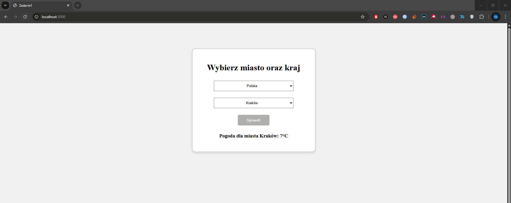
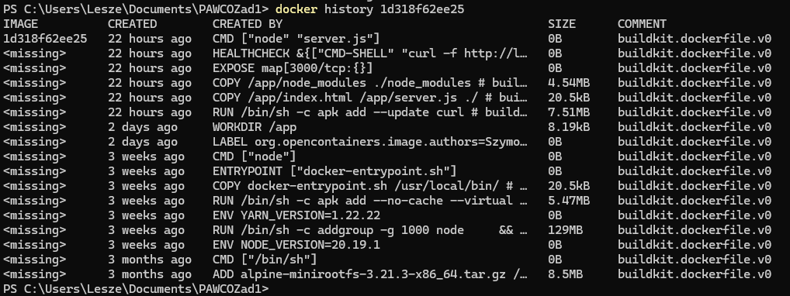

## Aplikacja
Aplikajca stworzona została przy użyciu NODE.js z frameworkiem Express.js. Pozwala ona na wybór kraju z listy, następnie wyświetla się lista dostępnych dla danego kraju miast. Po wybraniu kraju oraz miasta i kliknięciu przycisku wyświetla się pogoda dla danego miasta. W celu pobierania tych danych oraz ich wyświetlenia użyto języka Javascript oraz OpenWeatherMap - usługi internetowej udostępniającej globalne dane pogodowe.


### Plik serwerowy server.js
```
const express = require('express');
const path = require('path');
const app = express();
const PORT = 3000;

app.get('/', (req, res) => {
    res.sendFile(path.join(__dirname, 'index.html'));
});

app.listen(PORT, () => {
    const data = new Date().toLocaleString();
    console.log(`Data uruchomienia: ${data}`);
    console.log(`Autor: Szymon Oleszek`);
    console.log(`Port TCP: ${PORT}`);
});
```
źródło dla serwera: https://www.geeksforgeeks.org/steps-to-create-an-express-js-application/


### Plik index.html
```
<!DOCTYPE html>
<html>
<head>
    <meta charset='utf-8'>
    <meta http-equiv='X-UA-Compatible' content='IE=edge'>
    <title>Zadanie1</title>
    <meta name='viewport' content='width=device-width, initial-scale=1'>
    <style>
        html, body {
            height: 100%;
            margin: 0;
            background-color: #f0f0f0;
        }
        .kontener{
            display: flex;
            justify-content: center; 
            height: 100vh;
            padding: 10vh;
        }
        .kraje {
            display: flex;
            flex-direction: column; 
            gap: 10px;              
            align-items: center;
            padding: 30px;
            background-color: white;
            border: 2px solid #ccc;
            border-radius: 12px;
            box-shadow: 0 4px 8px rgba(0, 0, 0, 0.1);
            width: 400px;
            height: 325px;
        }

        select, button {
            padding: 10px;
            margin-bottom: 25px;
            width: 100%;
            box-sizing: border-box;
            text-align: center;
        }

        button {
            background-color: #afafae;
            color: white;
            border: none;
            cursor: pointer;
            width: 40%;
            margin-left: 30%;
            height: 40px;
            border-radius: 5px;
            margin-bottom: -1px;
        }

        button:hover {
            background-color: #c4c3c2;
        }
    </style>
</head>
<body>
    <div class="kontener">
        <div class="kraje">
            <h1>Wybierz miasto oraz kraj</h1>
            <form id="wybor-formularz">
                <select id="wybor-kraj">
                    <option value="" disabled selected>Wybierz kraj</option>
                    <option value="Polska">Polska</option>
                    <option value="Francja">Francja</option>
                    <option value="Japonia">Japonia</option>
                    <option value="USA">USA</option>
                    <option value="RPA">RPA</option>
                    <option value="Australia">Australia</option>
                </select>
                <select id="wybor-miasto">
                    <option value="" disabled selected>Wybierz miasto</option>
                </select>
                <button type="submit">Sprawdź</button>
            </form>
            <div id="pogoda-wynik">

            </div>
        </div>
    </div>
    <script>
        const kluczPogoda = '0bc89e86aac1d42b43036ca6122a876d';

        const cities = {
        "Polska": [
            { name: "Warszawa", lat: 52.22, lon: 21.01 },
            { name: "Kraków", lat: 50.06, lon: 19.94 },
        ],
        "Francja": [
            { name: "Paryż", lat: 48.85, lon: 2.35 },
            { name: "Lyon", lat: 45.75, lon: 4.85 },
        ],
        "Japonia": [
            { name: "Tokio", lat: 35.68, lon: 139.76 },
            { name: "Sapporo", lat: 43.06, lon: 141.35 },
        ],
        "USA": [
            { name: "LosAngeles", lat: 33.93, lon: -118.24 },
            { name: "NowyJork", lat: 40.71, lon: -74.00 },
        ],
        "RPA": [
            { name: "Kapsztad", lat: -33.92, lon: 18.42 },
            { name: "Pretoria", lat: -25.74, lon: 28.18 },
        ],
        "Australia": [
            { name: "Sydney", lat: -33.86, lon: 151.20 },
            { name: "Melbourne", lat: -37.81, lon: 144.96 },
        ], 
        };

        const KrajSelect = document.getElementById("wybor-kraj");
        const MiastoSelect = document.getElementById("wybor-miasto");

        KrajSelect.addEventListener('change', (e) =>{
            const KrajWybor=e.target.value;
            const KrajTab=cities[KrajWybor];
            
            MiastoSelect.innerHTML="";

            KrajTab.forEach(element => {
                MiastoSelect.innerHTML+="<option value="+element.name+">"+element.name+"</option>";
            });
        });


        document.getElementById('wybor-formularz').addEventListener('submit', (e) =>{
            e.preventDefault();
            const wynik=document.getElementById("pogoda-wynik");
            const kraj=document.getElementById("wybor-kraj").value;
            const miasto=document.getElementById("wybor-miasto").value;
            const pom = cities[kraj].find(x => x.name == miasto);


            fetch(`https://api.openweathermap.org/data/2.5/weather?lat=${pom.lat}&lon=${pom.lon}&appid=${kluczPogoda}&units=metric&lang=pl`)
                .then(response => response.json())
                .then(data => {
                var temperatura = data.main.temp.toFixed(0);
                wynik.innerHTML="<h3>Pogoda dla miasta "+miasto+": "+temperatura+"°C</h3>";
                })
                .catch(error => {
                console.error('Wystąpił błąd:', error); 
                });
            });
            
    </script>
</body>
</html>
```


## Plik Dockerfile
```
FROM node:20-alpine AS builder

WORKDIR /app

COPY package.json package-lock.json ./

RUN npm install

COPY . .

FROM node:20-alpine

LABEL org.opencontainers.image.authors="Szymon Oleszek"

WORKDIR /app

RUN apk add --update curl

COPY --from=builder /app/index.html /app/server.js ./
COPY --from=builder /app/node_modules ./node_modules

EXPOSE 3000

HEALTHCHECK --interval=10s --timeout=1s \
    CMD curl -f http://localhost:3000/ || exit 1

CMD ["node", "server.js"]
```
Dockerfile wykorzystuje technikę multi-stage building w celu optymalizacji finalnego obrazu, do którego kopiowane są tylko niezbędne pliki. Pierwszy obraz (node:20-alpine) jest wykorzystywany jako builder i służy do przygotowania aplikacji. Potrzebne zależności są instalowane przed skopiowaniem wszystkich plików. Wykorzystano również healthcheck w celu oceny jakości stworzonego kontnera.


## Polecenia oraz zrzuty ekranowe
#### Budowanie obrazu:
    docker build -t zadanie1 .


#### Uruchomienie obrazu:
    docker run -p 3000:3000 --name zadanie1kontener zadanie1


#### Sprawdzenie healthcheck:
    docker ps


#### Działanie aplikacji:



#### Pozyskanie informacji z logów:
    docker logs


#### Rozmiar obrazu:
    docker images


#### Warstwy:
    docker inspect
